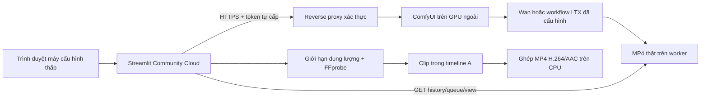

# AI Video Generator — kế hoạch triển khai

## Phạm vi PR này

Bắt đầu từ main 8974470 sau merge PR #2. Giữ nguyên app.py, studio.py và backend media/subtitle/TTS A; bổ sung package studio_pro/ai_video và một nguồn clip mới trong trình biên tập. Các mô hình không được cài hoặc chạy trên Streamlit Cloud hay GTX 750 Ti 2 GB/RAM 8 GB. Phần mềm kết nối miễn phí, không cấp phát/thuê GPU, không tích hợp dịch vụ API trả phí.

**PR này triển khai kết nối và quản lý tác vụ; chưa chứng minh sinh phim AI trên GPU thật.** Zoom/pan/Ken Burns vẫn là chức năng A, không được đổi tên thành AI chuyển động. Chế độ phim có thể yêu cầu mọi cảnh phải là clip MP4 để không tự xuất ảnh/nền đồ họa cho cảnh thiếu clip.

## Kiến trúc

- `config.py`: URL/token/catalog từ Secrets hoặc env; endpoint chỉ do chủ app cấu hình, HTTPS/public cho Cloud. Không đưa token ra UI, record hay log. Local HTTP chỉ được dùng loopback và phải bật profile local + AI_VIDEO_ALLOW_LOCAL=1.
- `workflows.py`: đồ thị ComfyUI định dạng API do chủ worker duyệt; ánh xạ prompt/ảnh/seed/FPS/frames/kích thước/prefix rõ ràng. Số frame được lượng tử hóa theo mô hình (Wan 4k+1; profile LTX có thể dùng 8k+1). Metadata/model weights phải khớp phiên bản thực tế, không tự tải model trong app.
- `comfy.py`: health `/system_stats`, schema `/object_info`, ảnh `/upload/image`, gửi `/prompt`, theo dõi `/history/{id}` + `/queue`, tải `/view`. Không mở WebSocket dài hạn trên Cloud trong PR này. Queue/history cho biết giai đoạn, không cho phần trăm diffusion; UI không dựng thanh phần trăm giả.
- `ui.py`: endpoint chỉ đọc, bật kết nối mặc định false, kiểm tra node/model/CUDA trước gửi, đồng ý từng tác vụ, nhập hành động/nhân vật/bối cảnh/camera/thời lượng/seed/ảnh theo cảnh, polling thủ công hoặc fragment mỗi 5 giây, xem/tải/đưa clip vào timeline.

## Trạng thái và chống trùng tác vụ

`queued → running → complete → downloaded`; ngoài ra `failed`, `submission_unknown`, `missing`, `timed_out`, `paused`.

- UUID/client_id riêng trước POST. ComfyUI mới có thể dùng prompt_id do client đề xuất; phiên bản cũ có thể trả ID khác. Nếu timeout/5xx/phản hồi không đọc được, lưu trạng thái chưa rõ, không retry POST. Đối chiếu history và client_id trong queue để phục hồi khi có thể.
- Worker mất mạng không đồng nghĩa model thất bại. Job bị mất khỏi queue/history không được coi là thành công; có thể do worker restart/xóa history hoặc phiên bản cũ trả ID chưa nhận được khi timeout. Cần chủ worker tra lại job; không tự gửi lại.
- Hết thời gian chỉ kết thúc theo dõi phía web. “Ngừng theo dõi” không hủy GPU; không dùng /interrupt hoặc clear queue ảnh hưởng tác vụ khác. “Theo dõi lại” chỉ GET job cũ, không tạo job mới.
- MP4 tải về phải đúng output node, type=output, đường dẫn an toàn, tối đa 25 MB; FFprobe kiểm tra container/video/duration/độ phân giải. Ảnh/GIF/kết quả lỗi không được thay bằng animation ảnh. Không đánh giá được nhân vật có đi lại đúng ý hay không chỉ từ metadata; người dùng phải xem và đánh giá clip.
- Gắn clip vào scene ID theo revision hiện tại; chia lại cảnh xóa các clip đã gắn, job cũ còn để tải. Thời lượng cảnh cập nhật từ MP4 thật, cần cập nhật SRT. Không kéo dài clip AI dưới 1 giây bằng ảnh cuối để thay kết quả thiếu.
- Tối đa 20 bản ghi và 150 MB kết quả tải trong phiên. Job ID hiển thị để chủ worker tra lại; danh sách vẫn là dữ liệu phiên, chưa có lưu dự án bền vững/khôi phục job sau Cloud restart. Download MP4 và ghi ID trước khi đóng phiên. Worker cần giữ history/output đủ lâu; không tự xóa media trên worker.

## Workflow trong repository

Hai đồ thị native mẫu tự viết: Wan 2.1 T2V 1.3B và I2V 480p 14B, CreateVideo → SaveVideo MP4. Đã kiểm tra cấu trúc/binding, **chưa thực thi với model/GPU**. Node core mới/cũ có thể khác schema: nút kiểm tra sẽ phát hiện node/input/model thiếu và chặn gửi. Worker phải kiểm chứng workflow bằng UI ComfyUI trước khi đưa vào app.

Adapter không phụ thuộc tên mô hình; LTX-Video có thể dùng workflow API export + profile bindings riêng do chủ worker kiểm chứng (fps, bước frames, output MP4). Chưa cung cấp profile LTX đã được kiểm chứng GPU. Không biến endpoint Comfy Cloud trả phí thành mặc định. Node API được nhận diện theo tên/schema bị từ chối; chủ worker vẫn phải duyệt mã custom node và kiểm tra nó không gọi dịch vụ trả phí.

## Thiết kế dựng phim chuyên nghiệp — PR tiếp theo, chưa có nút giả

| Lớp | Dữ liệu dự kiến | Cách triển khai và kiểm chứng |
| --- | --- | --- |
| Video track | MP4 nguồn, in/out, tốc độ, mốc cảnh | Giữ clip có chuyển động từ worker; normalize FPS/timebase; không dùng zoom ảnh làm thế thân |
| Animated titles | Chữ, font, màu, khoảng thời gian, fade/slide/rise | FFmpeg drawtext/overlay hoặc ASS do server tạo; escape chữ, font tiếng Việt, kiểm tra pixel theo mốc |
| Kinetic typography | Cụm chữ và các keyframe scale/position/opacity | ASS transform/move hoặc render lớp RGBA; tách timeline chữ khỏi video nguồn |
| Phụ đề động | Word/cue timing và highlight/karaoke | ASS karaoke với timing đã chỉnh/ASR worker; không tự nhận word alignment nếu chỉ có timing ước lượng |
| Chuyển cảnh | cut/fade/dissolve/wipe và overlap | FFmpeg xfade; tính lại mốc timeline, narration và SRT khi có overlap; test không lệch audio |
| Âm thanh | Narration, nhạc, ambience, SFX và ducking | Mở rộng audio track A bằng amix/sidechaincompress, fade, limiter; kiểm tra mẫu âm thanh |
| Project | Versioned manifest, media, provenance worker/model/seed/job | ZIP và lưu bền vững độc lập phiên (kế hoạch B); không lưu token; tránh download lại/upload lại model |

## Điều kiện nghiệm thu inference thật

1. Có worker được quyền sử dụng, model/checkpoint và license đúng; ComfyUI/UI workflow xuất MP4 thành công trước.
2. Staging Streamlit truy cập HTTPS có auth, T2V và I2V được tạo trên GPU thật với các mô tả đi/chạm/quay đầu, cây/nước/xe chuyển động.
3. Xem đủ clip và đối chiếu prompt/seed/job/model; kiểm tra không chỉ camera chuyển trên ảnh cố định. Ghi GPU, VRAM, version, runtime, clip mẫu và hash output. Metadata/HTTP mock không đáp ứng nghiệm thu này.
4. Clip từ app đi vào đúng cảnh, không đổi thứ tự/media A, gắn subtitle và xuất cuối được kiểm tra hình/audio/timing.
5. Tình huống worker mất kết nối, hết quota, OOM, timeout, restart và URL tunnel thay đổi có thông báo, không tự retry có thể tạo nhiều job.

Chưa có worker trong phiên phát triển này nên điều kiện 1–5 về inference/staging còn chờ; kiểm thử contract, HTTP loopback và hồi quy được ghi riêng.
